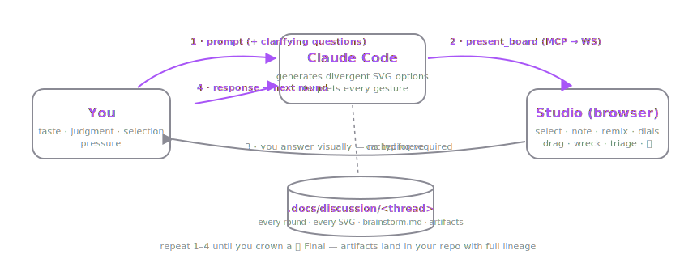
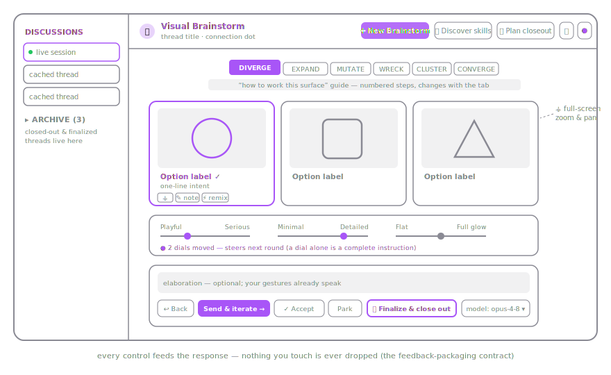

# Visual Brainstorm — User Guide

Brainstorm with Claude in pictures instead of paragraphs. Claude presents SVG options as an
interactive survey in your browser; you select, annotate, remix, and steer; every round and
artifact is cached to your repo forever.



## 1. Setup

```sh
npm install
npm run build
npm test          # 23 unit tests + integration smoke + UI render smoke — all must pass
```

**Connect Claude Code (the real engine).** In this repo, `.mcp.json` auto-loads the MCP
server — just start `claude` here. For any other project:

```sh
claude mcp add visual-brainstorm -- node C:/Code/svgbrainstorm/apps/mcp/dist/index.js
```

Tip: raise the tool timeout so boards can wait for humans: `MCP_TOOL_TIMEOUT=1800000`.

**Preview without Claude:** `npm run preview [phase]` serves static fixture boards for
looking at the UI — it has no generator and says so in the interface.

## 2. Running a brainstorm

Say to Claude Code: **"brainstorm: app icons for a note-taking tool — warm, hand-drawn"**.
Claude clarifies with a few questions, then your browser opens with the first board. From
there the loop is: respond in the studio → Claude interprets everything → next board.
Resume any cached thread later: *"resume brainstorm \<thread-id from the left nav\>"*.

## 3. The studio, control by control



**Left nav** — every cached thread; click to reopen read-only. **Archive** holds threads
finished by plan closeout or 🏁 finalize.

**Phase tabs** (Diverge · Expand · Mutate · Wreck · Cluster · Converge) — the funnel. Claude
picks a phase per round, but the tabs are CLICKABLE: switch the mechanic instantly and your
choice becomes the requested phase for the next round. Each tab shows a "how to work this
surface" guide.


In short:

| Tab | You do | Next round |
|---|---|---|
| Diverge | select what has legs; ⚡ remix pairs; ✎ notes | pure syntheses of your picks — rejected options never return |
| Expand | select what resonates (≥1) | pool GROWS with new syntheses; nothing removed |
| Mutate | view one option through distortion lenses; mark what "reveals something" | that distortion is leaned into |
| Wreck | write ≥3 flaws — brutal beats polite | each flaw returns as a fix candidate |
| Cluster | drag similar options together; click the pulsing ? gaps and name them | gap notes spawn hybrids; clusters teach Claude your taxonomy |
| Converge | keep / kill / merge every option; crown ONE with 🏁 Final | keeps are captured; kills are forever; 🏁 Finalize ends the brainstorm AND runs plan closeout |

**Every gesture counts** — this is the core contract:
- **Dials** (min 5 per board, tailored to your topic): moving a dial and sending — with
  nothing else — is a complete instruction; the next round is visibly re-tuned. Moved dials
  show a ● and "steers next round".
- **⛶** on any card (or clicking history thumbnails) opens a full-screen preview with wheel
  zoom, drag pan, and pinch on mobile — built for dense system diagrams.
- **model** picker: the next round's generation is delegated to the model you choose.
- **↩ Back**: this round didn't work — re-present the previous board (bypasses all gates).
- **Send & iterate / ✓ Accept / Park**: continue, capture and wrap up, or pause (the thread
  stays resumable).

**Header buttons**: ✚ New Brainstorm (type a prompt; needs the Claude engine) · ✨ Discover
skills (match or web-discover craft, ingested as repo skills) · 📦 Plan closeout (harvest
learnings, improve the repo's commands, archive the thread) · 🧾 live logs · theme picker.

## 4. Where everything is saved

Each thread: `.docs/discussion/<stamp>-<slug>/` — `brainstorm.md` (readable text memory of
every round + response), `round-NN/` (board JSON + every SVG + your response), `artifacts/`
(accepted SVGs with provenance). Committable; nothing is ever regenerated.

## 5. Configuration

`visual-brainstorm.config.json` in your project root: `targetRepo` (artifacts also copied
there), `stylesDir` (drop-in theme JSONs — see `styles/sunset.json`), `theme`, `models`,
`defaultModel`, `discussionDir`. Themes are also switchable visually in the header.

## 6. When something looks broken

1. `curl http://127.0.0.1:5199/api/health` — who owns the port? (pid, session, engine)
2. 🧾 button or `GET /api/logs` or `.docs/discussion/.logs/*.log` — pid-tagged event trail.
3. Most common cause: a stale instance holding 5199 while yours fell back to another port —
   the startup output prints the REAL URL; trust it.
4. Full procedure: `.claude/commands/diagnose-studio.md`, or ask Claude to use the
   **devops-diagnostician** agent.
