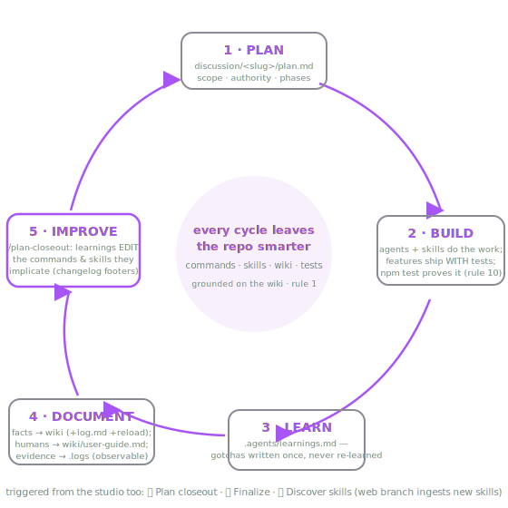

# The Agentic Loop — build · learn · document · improve (AUTHORITATIVE)

This repo's agentic architecture is load-bearing: every unit of work runs the loop below, and
every cycle must leave the repo smarter — better commands, sharper skills, truer wiki, more
tests. Skipping a stage is a process failure, not a shortcut.



## The five stages

| Stage | Home | Entry | Exit criteria |
|---|---|---|---|
| 1 · PLAN | `discussion/<slug>-<date>/plan.md` | any multi-step task (rule 3) | scope, authority, phases written BEFORE implementation; the plan is **loopable** — phase table with Status + append-only Progress log in the same file (`/create-dispatch-command` scaffolds or retrofits it; its emitted `/dispatch-<slug>-next-phase` runs one phase per tick and persists progress back to the plan) |
| 2 · BUILD | agents (`.claude/agents/`) + skills (`.claude/skills/`) + commands (`.claude/commands/`) do the work (rule 11) | plan exists; **grounded on the authoritative wiki** (below) | features ship WITH tests; `npm run build` + `npm test` green (rule 10); verified units committed (see Ship discipline); no unreconciled wiki↔code drift |
| 3 · LEARN | `.agents/learnings.md` (newest first) | anything discovered the hard way | one entry per non-obvious fact + why it matters; nothing re-learned next session (rule 4) |
| 4 · DOCUMENT | facts → `wiki/` + `wiki/log.md` line (rules 1–2); human-facing → `wiki/user-guide.md` (rule 12); runtime evidence self-documents via logs/health (`System/testing-observability.md`) | facts or UX changed | wiki and code agree; every edit logged; guide matches the product; **grounding index reloaded** (`wiki_reload`) so the next cycle grounds on current bytes |
| 5 · IMPROVE | `/plan-closeout` (`.claude/commands/plan-closeout.md`) | plan's work verified | each learning EDITS the command/skill it implicates (+ `## Changelog` footer line); plan + threads archived to `_completed/`; closeout commit **pushed to origin** |

## The wiki is the loop's guardrail (rule 1), not just its stage-4 output

The wiki is authoritative, so it is **read as a guardrail at every stage, not only written at
stage 4**. This is what makes it a guardrail rather than an archive:

- **Ground before you PLAN and while you BUILD.** Before scoping work and before changing a
  contract, ground on the pages your task touches via the `visual-brainstorm-wiki` MCP —
  `wiki_search` → `wiki_outline` → `wiki_read(path, heading)` (context-shaped, never
  whole-page dumps). The procedure is `System/wiki-grounding.md`; the cheap entry is the
  CLAUDE.md §Session bootstrap + quick map.
- **On drift, reconcile — never silently proceed.** If code contradicts the wiki, the cycle
  STOPS and reconciles: fix whichever side is wrong, with evidence, and log it (rule 1). A
  BUILD that ships against a wiki it quietly contradicts has skipped a stage. Unresolvable
  contradictions open a `discussion/` plan (see `/wiki-maintenance`), they are not papered over.
- **Close the read/write circuit at DOCUMENT.** Stage 4 writes plain-file, logs the edit
  (rule 2), and **reloads the grounding index** (`wiki_reload`) so the next cycle grounds on
  the current bytes — a stale index would let the guardrail drift out from under the loop.
- **Owners.** The `wiki-librarian` grounds-then-reloads on every capture; `/plan-closeout`
  step 5 reloads per plan; `/wiki-maintenance` is the cross-plan lint/reconcile sweep. See
  `System/wiki-grounding.md` for the binding contract.

## Ship discipline — a cycle ends on origin, not on "green"

- **Commit verified units during BUILD.** Once a unit passes its checks, commit it:
  `git commit --only <the exact paths this work touched>` — **never `git add -A` /
  `commit -a`** (donor rule: several sessions can share one working tree; `-A` captures
  someone else's WIP). Subject is one conventional line: `feat(<scope>): …`,
  `fix(<scope>): …`, `chore(<scope>): …`.
- **Push at closeout.** `/plan-closeout` ends with a closeout commit and `git push`
  (its Commit-and-push step). Uncommitted or unpushed work at the end of a cycle is a
  process failure, same as a skipped stage.
- **A brainstorm ships a plan.** When a brainstorm thread finalizes, its most valuable
  output is a loopable build plan (intent + phases + exit criteria, never code) authored
  from the thread's `brainstorm.md` decision records — into the TARGET repo via *its own*
  `/create-dispatch-command` when it has one, else in our simple format
  (`/plan-closeout` step 7).

## What makes it a loop, not a checklist

- **Commands and skills are living documents.** Closeout step 4 exists to feed learnings
  BACK into the procedures — the same task gets easier and safer every cycle. The
  `## Changelog` footers are the visible growth rings.
- **The authoritative layer outlives any one harness.** `.claude/commands`, `.claude/skills`,
  `.claude/agents`, and the wiki contracts are the behavioral SSOT. Harness adapters such as
  `.github/` for GitHub Copilot — and future CODEX/Cursor adapter layers if and when they
  exist — reference that layer. When a workflow entry point, protocol contract, or
  user-facing harness behavior changes, the same cycle reconciles the supported adapters so
  comparable results remain achievable across harnesses. This is conditional, not a tax on
  every plan: if a change does not affect adapters, no adapter work is required.
- **The studio participates.** Plan closeout (composer More Tools menu, the + button) and
  Finalize & close out trigger stage 5 from the UI; Discover skills (same menu, web branch)
  ingests
  brand-new skills mid-brainstorm, so craft
  compounds *inside* a session, not just between them.
- **Agents are the muscle memory** (`System/agents.md`): diagnosis, delegated generation,
  testing, and wiki-keeping each have an owner with the procedure embedded — a fresh chat
  doesn't improvise, it routes (CLAUDE.md rule 11 + the quick map).
- **Learnings harvest and compaction.** `/compress-learnings` (sonnet) runs manually or via `/loop` (not auto-fired by hooks). Primary job: harvest durable lessons into the agentic layer (commands/skills/agents/wiki) so they enforce next session, surfacing missing commands/skills/agents via AskUserQuestion. Secondary: compact the log every two weeks OR when `.agents/learnings.md` exceeds 700 lines — recent entries (14-day window) stay verbatim, older entries distill to one-liners, full originals archive to `.agents/learnings-archive.md` (rule 6 — nothing lost).
- **Long-lived subagents replay stale context.** Resuming one agent across a work stream
  (e.g. the wiki-librarian across many UI waves) keeps its context and works well, but its
  repeated "standing flags" come from its OWN old transcript, not the current tree — the
  coordinator verifies a repeated flag against the file before acting and tells the agent
  explicitly when a flag is resolved.
- **Cold-start guarantee:** a brand-new session reads CLAUDE.md §Session bootstrap and is
  fully operational — wiki authority (grounded via the `visual-brainstorm-wiki` MCP), plans,
  learnings, commands, skills, agents, tests, logs — without any chat history.

## Memory map (what persists where — never blur these)

```
wiki/                  facts & guardrails (authoritative; every edit logged; grounded/read via
                       the visual-brainstorm-wiki MCP, reloaded after edits — wiki-grounding.md)
discussion/      plans + brainstorm threads (boards, SVGs, responses, brainstorm.md)
wiki/user-guide.md    how humans use the tool (SVG-illustrated)
.agents/learnings.md   hard-won gotchas (recent 14-day window, verbatim)
.agents/learnings-archive.md   full original entries (moved by /compress-learnings; rule 6)
.claude/commands/      repeatable procedures (self-improving)
.claude/skills/        binding craft
.claude/agents/        specialized roles (brainstorm-orchestrator also carries its living ## Orchestration learnings section)
.github/               workspace-local harness adapters (GitHub Copilot today) pointing at the
                       authoritative `.claude/` layer; future CODEX/Cursor adapters follow the
                       same shape when support is real
tests/ + scripts/      executable proof
discussion/.logs runtime evidence (+ /api/health, /api/logs)
```
