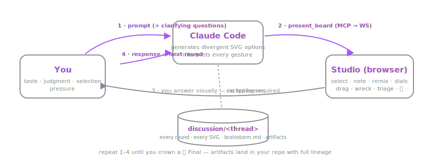
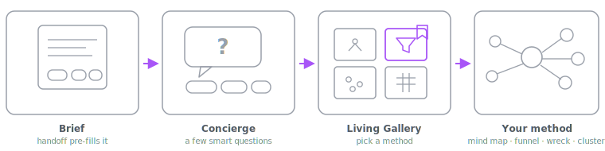
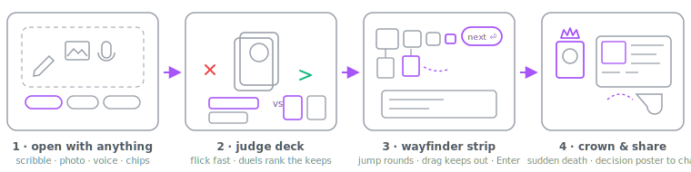
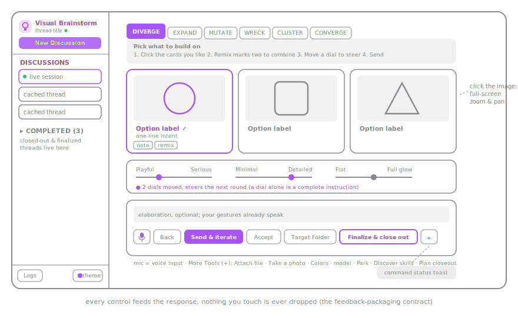
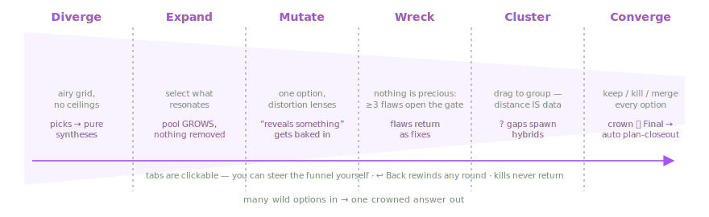

# Visual Brainstorm — User Guide

Brainstorm with Claude in pictures instead of paragraphs. Claude presents SVG options as an
interactive survey in your browser; you select, annotate, remix, and steer; every round and
artifact is cached to your repo forever.



## 1. Setup

```sh
npm install
npm run build
npm test          # 23 unit tests + integration smoke + UI render smoke — all must pass
```

**Connect Claude Code (the real engine).** In this repo, `.mcp.json` auto-loads the MCP
server — just start `claude` here. For any other project:

```sh
claude mcp add visual-brainstorm -- node C:/Code/svgbrainstorm/apps/mcp/dist/index.js
```

Tip: raise the tool timeout so boards can wait for humans: `MCP_TOOL_TIMEOUT=1800000`.

**Use GitHub Copilot locally in VS Code (the interactive path).** This repo ships the
discoverable `.vscode/mcp.json` workspace manifest for both local stdio servers. After
installing dependencies and running `npm run build`, trust the workspace, open **MCP: List
Servers**, and start/trust `visual-brainstorm` plus `visual-brainstorm-wiki`. The manifest uses
VS Code's `servers` schema and `${workspaceFolder}` as the working directory. This is the
supported full-studio route: the browser can reach the bridge on your local `127.0.0.1` and you
can answer its boards. Both this manifest and the root `.mcp.json` deliberately omit
`VIBR_COPILOT_HOSTED`, so the local interactive studio remains enabled.

In Copilot Chat, type `/` to use workspace prompts such as `run-brainstorm`, `build-check`,
`plan-closeout`, `discover-skills`, `diagnose-studio`, `artifact-chat`, `reopen`,
`new-command`, or `create-dispatch-command`. They remain thin adapters over the authoritative
`.claude/` workflows and the same local MCP/studio stack. Repo tests prove the registry →
adapter-map → prompt/agent chain and real MCP startup contracts; whether slash entries appear in
the Copilot `/` menu remains a VS Code host behavior to spot-check after host upgrades. Workspace
trust, server start/discovery, and MCP tool/menu behavior are VS Code-managed manual checks.

**GitHub-hosted Copilot is a noninteractive runner path.** `.github/mcp.json` is a versioned,
GitHub-compatible `mcpServers` payload with explicit tool allowlists, but GitHub.com does not
discover it automatically. GitHub-hosted agents receive it through relevant agent-scoped
`mcp-servers` declarations or a repository administrator pastes it into **Settings > Copilot >
MCP servers**. The setup workflow runs `npm ci` and `npm run build` before cloud agents launch
the dist-based servers, then runs `npm run check:copilot-parity`,
`node --test tests/copilot-mcp.test.mjs`, and `node --test tests/copilot-adapter.test.mjs`.
Its push and pull-request filters treat `.github/agentic-surface-registry.json`,
`.github/prompts/**`, and `tests/copilot-adapter.test.mjs` as parity-owned paths; the adapter
test proves the authoritative registry -> Copilot adapter registry -> prompt/agent wrapper chain.

Those servers run inside an ephemeral Actions runner. Its product bridge listens only on the
runner's `127.0.0.1`, so it cannot show you the browser studio or collect a board response. The
hosted product entry and product-capable agent declarations set `VIBR_COPILOT_HOSTED=1`; with that
flag, the server refuses `open_studio`, `ask_concierge`, `present_gallery`, and `present_board`
with `{ status: "unsupported-host" }` before starting a bridge. The focused MCP test actively
calls all four tools with `VIBR_COPILOT_HOSTED=1` and requires that refusal before a bridge can
start. A hosted run therefore cannot claim that it completed a full interactive brainstorm; use
local VS Code Copilot Chat for that journey. Its read-only wiki server and other noninteractive
MCP operations can still be useful. GitHub organization policy, repository MCP-settings/custom-
agent acceptance, and runner working-directory/host-service behavior are GitHub-managed manual
checks. A Copilot-run tool call is a Copilot action, not a Claude-engine run merely because the
bridge's runtime metadata may mention Claude.

**Use Codex in this workspace.** This repo also ships a Codex adapter: `.codex/config.toml`
registers the local `visual-brainstorm` and `visual-brainstorm-wiki` MCP servers, `.codex/hooks.json`
pipes progress and runs the agentic-surface guard, `.codex/agents/*.toml` adapts the five
specialist personas, and `.agents/skills/` mirrors the authoritative `.claude/skills/` craft.
Trust the project in Codex, restart the task, then check `/mcp` for both servers. The Codex
layer is intentionally a wrapper: read and execute `.claude/commands/*.md` for procedures.

## 2. Starting a brainstorm, step by step

1. **Open a terminal in the project you want artifacts saved to.** In this repo the MCP
   server auto-loads via `.mcp.json`; in any other project register it first (see §1).
2. **Start Claude Code, Codex, or local VS Code Copilot Chat:** use `claude` for the native
  harness; start Codex after trusting the repo so `.codex/` project config loads; or use VS
  Code Copilot after starting/trusting both servers through **MCP: List Servers**.
3. **Check the connection (first time):** type `/mcp` in Claude Code or Codex —
  `visual-brainstorm` should be listed as connected. In VS Code Copilot, verify both entries
  in **MCP: List Servers**. If they are absent, repeat the relevant setup and restart the host.
4. **Say what you want, prefixed however feels natural:**
   - *"brainstorm: app icons for a note-taking tool — warm, hand-drawn, must read at 16px"*
   - *"let's visually brainstorm the architecture for our search feature"*
   - or invoke the procedure directly: `/run-brainstorm`

   A **bare `/run-brainstorm`** (no topic) skips the terminal interrogation: the studio
   opens directly on the **New Discussion** panel (via the `open_studio` tool) and Claude
   waits for whatever you submit there. If you already described the purpose to Claude in
   step 4, the panel greets you with a **summary of the brainstorm** (in place of the generic
   prompt), the brief box is **pre-filled**, and the intake questions are **written for your
   specific brainstorm** and **pre-answered with recommendations** — so you can refine or just
   click **Send & iterate**, no retyping. (Starting from the **New Discussion button** in the UI
   instead shows a generic starter set of questions, since Claude hasn't heard your idea yet.)
5. **Your browser opens automatically** at the studio (default `http://127.0.0.1:5199`) on
   the **New Discussion** panel. If no tab appears, the URL is in Claude's message.

**The intake journey — three stages that seed your brainstorm:**



6. **Stage 1: Enter your brief.** The New Discussion panel collects your idea (see "New
   Discussion — open with anything" below for the full panel description). Refine the brief
   and click **Send & iterate** when ready.

7. **Stage 2: Concierge asks clarifying questions.** Claude moves to the **ConciergeIntake**
   surface and asks ONE question at a time — domain-tailored to your idea (audience,
   constraints, what "good" looks like, scope, liveness). Each question has tappable
   suggestion chips plus a free-text box. Answer and send; Claude asks the next. This loop
   runs as many rounds as it takes (not a fixed count; comprehensiveness pays off). Every
   answer lives in your thread's memory so Claude can weave them in.

8. **Stage 3: Pick a method.** Claude presents the **Living Gallery** — a set of method
   cards (Mind map, Funnel, Wreck, Cluster), each seeded with a tiny live SVG grown from
   your brief and answers. ONE card is highlighted with a **"Recommended"** ribbon and a
   reason chip quoting your answers (Claude's suggestion, not a mandate). Click any card to
   start that methodology.

9. **What happens next depends on your pick:**
   - **Mind map:** The studio opens a live co-edited **mind-elixir canvas**. Double-click any
     node to rename it, press Tab to add a child, drag to rearrange; select a node to
     **Explode** it into idea prompts, add **+5** ideas, attach a steering **Note**, or
     **Delete** it. As you edit, the tree updates live; your final structure returns to Claude
     as your brainstorm "response" (structure IS the response). The **maximize** icon (top-right
     of the map) opens the map full-screen with a **chat on the right** — ask about it or ask
     Claude to improve it in words, exactly like any artifact; the map stays put while Claude
     answers. Claude reads your current tree — your latest edits are saved the moment you maximize — and can grow you an improved map. Your tree is saved with the thread in a form Claude reads and builds the next
     round + the final plan directly from — the structure you draw anchors everything.
   - **Funnel, Wreck, or Cluster:** The brainstorm continues into the standard funnel:
     diverge, expand, mutate, wreck, cluster, converge. You'll select options, move dials,
     add notes, and steer each round exactly as in a regular brainstorm (see §3).

10. **Finish** with **Accept** (capture the keepers) or **Finalize & close out** (crown THE
    one — this also runs plan closeout and archives the thread), or **Park** (in the
    composer's More Tools menu) to pause. If a target repo is set (the **Target Folder**
    button in the composer), Claude asks at closeout exactly where inside it the final
    artifacts should go and COPIES them there — the originals stay archived in the thread.

**Resume later:** in a new Claude session say *"resume brainstorm \<thread-id\>"* — the id is
shown in the studio's left nav (e.g. `2026-07-06-1902-visualize-5-…`). The whole history
reloads from the cache; nothing is regenerated.

**New Discussion — open with anything.** The button sits directly under the app title at
the top of the left nav; clicking it swaps the main timeline for the full brainstorm-intake
**chat panel**. An empty live session (no rounds, no active board) lands on this panel
automatically — it is also where a bare `/run-brainstorm` puts you. This is **Stage 1 of
the intake** (see above). Top to bottom:
- a Claude-side intro bubble;
- a **survey of tappable questions** (the Survey module): *What are you making?* (icons /
  a logo / a ui flow / a palette / a system map / new feature / comparison), *What's the
  vibe?* (calm / playful / bold / minimal / neon / formal / professional), *How far should
  it push convention?* (stay close to convention / go wild), *Who is it for?* (just me /
  my team / customers / kids / executives), and *Any hard constraints?* (works tiny /
  monochrome-safe / high contrast / print friendly / square format). Tap the answers (some
  questions are multi-select) or type your own in each **"or your own…"** field — your
  answers join the brief. Adaptive follow-up questions are the live concierge's job (Stage 2);
- a **Colors** card: each theme carries a curated named 5-color palette; click a theme's
  NAME to make its whole palette the generation palette (click again to clear; leave empty
  for free choice); click any swatch to edit that color and its name, or **+** to add one;
- a **Scribble a seed** pad, collapsed by default (expand it to sketch; it then fills the
  remaining space; sketches are saved
  under `discussion/.seeds/` and Claude reads the file as part of the brief); photos and
  files now arrive via the composer's **+** menu, not a drop zone. **Annotate a photo:**
  whenever an image lands (Take a photo, or an attached image file) the composer offers to
  **scribble on it** — accept and the photo becomes the pad's background, where a small
  toolbar lets you **Pen** (draw), **Highlighter** (thick translucent emphasis), **Arrow**
  (drag to point), **Box** (drag to circle a region), and **Text** (click to drop a styled
  note-overlay card). Each tool draws in a color you pick from the current palette swatches
  (per-tool); **undo** removes the last mark, **clear** removes all, and **Maximize** opens
  the pad fullscreen for precise marking (input-only — no chat). The pad keeps the photo's
  aspect ratio (no stretch). On send, the studio renders a **composite PNG** (the photo WITH
  your marks — what Claude actually SEES) and persists a traversable folder under
  `discussion/.seeds/seed-<stamp>/` (`composite.png`, `photo.png`, `scribble.svg`, and
  `scribble.json` — every mark with its palette color name + coordinates — plus a `README.md`).
  Claude reads it via `/read-scribble` and **anchors the whole brainstorm on your marks** — an
  arrow's target is the focus, a note's text is a literal instruction. The original photo also
  stays a plain attachment (a clean, vision-readable copy);
- a **composer** with full board-composer parity: **Mic** · **Cancel** (hidden when the
  panel is the landing surface) · **Send & iterate** · **Target Folder** · **+** (Attach
  file, Take a photo, Model for generation). Attachments show as removable chips; the brief
  box grows with its content, capped at 30% of the viewport, then scrolls internally.

**Send & iterate** is enabled by a prompt OR a sketch OR an attachment, and starts the
intake journey when the live Claude Code runtime is attached. You can also dictate the brief (the mic
button is honestly disabled where the browser has no speech recognition). Chosen model and
colors travel with the brief.

**The one-sitting journey** the studio is built around:



## 3. The studio, control by control



**Left nav** — the app's home base. At the top, the **brand block**: the lightbulb icon,
the "Visual Brainstorm" title, the session subtitle with its connection dot, and the **New
Discussion** button. Below that, every cached thread; click to reopen read-only. **Completed**
holds threads finished by plan closeout or finalize (collapsible section; moved there by the closeout procedure). Pinned to the nav's bottom: the
**Logs** button (bottom-left, live bridge logs) and the **theme picker** (bottom-right) —
picking a theme also binds it to the live discussion, so every discussion keeps its own
look (an archived thread reopens in ITS theme; without a discussion theme your local pick
applies, then the config default). On
small screens the nav is hidden behind a floating hamburger button at the top-left; command
status messages appear as a toast at the bottom-right. A glow point continually traverses
the nav's edge like a star circling it.

**Look & feel** — every surface is finished in *liquid chrome* (a glassy gloss over the
theme fill), and a slow, theme-tinted **aurora** drifts unpredictably behind the app so the
chrome catches moving light. All of it re-skins with the picked theme and honours
`prefers-reduced-motion` (the motion stops; the surfaces stay).

**Wayfinding pulse** — a single glowing point (the same chrome-star look as the nav edge)
drives you through what to do next. It laps the nav, then flies to the closest point on the
next card, circles it twice, and continues down the surfaces — finishing by circling the
reply composer twice before flying back to the nav to repeat. Only one box pulses at a time.
As it circles a card whose answer is **complete** (you've done enough to send, or it was
prefilled) the pulse turns **green** — a card still needing you keeps the accent colour — so
at a glance the green boxes are ticked off and the accent ones are what's left. While Claude
is working on your reply the pulse simply circles the nav until the next board arrives. Like
the rest of the motion, it honours `prefers-reduced-motion` (it disappears entirely).

**Intake surfaces** (New Discussion, ConciergeIntake, LivingGallery) — the three-stage
intake that seeds every brainstorm. **New Discussion** collects your brief (§2, Stage 1).
**ConciergeIntake** presents Claude's clarifying questions one at a time with tappable
suggestion chips and free-text input (§2, Stage 2). **LivingGallery** displays the method
cards — each with a live SVG preview of how that method would approach your brief — and
you pick one to start (§2, Stage 3).

**Mind map canvas** — when you pick Mind map in the Living Gallery, the studio opens a
live co-edited **mind-elixir canvas** instead of the phase funnel. Double-click any node to
rename, Tab to add a child, drag to rearrange. Select any node and use the per-node action bar:
- **Explode** — fans the node into 5 topic+note-anchored prompt children immediately (via `addChild(el, generateNewObj())`). Each prompt topic is of the form `<topic> · <note> — <facet>` (facets: core, variation, bold take, risk, next step). These are PROMPT placeholders, not fabricated ideas; the orchestrator enriches each into a genuinely relevant option next round.
- **+5 ideas** — immediately seeds five blank child nodes under the selected node (hardened to pass parent element explicitly).
- **Note** — attach free-text steering to the node; a note that changes a node's meaning changes what an explode generates.
- **Delete** — removes the node and its subtree; the root cannot be deleted.
Your tree edits are the "response" that returns to Claude (structure IS the feedback).

**Phase tabs** (Diverge · Expand · Mutate · Wreck · Cluster · Converge) — the funnel,
left-aligned liquid-chrome tabs sized to their labels, attached flush to the full-width
guide bubble beneath them. Claude picks a phase per round, but the tabs are CLICKABLE:
switch the mechanic instantly and your choice becomes the requested phase for the next
round. Each tab's guide bubble shows "how to work this surface" in numbered plain-language
steps. (These are used when you pick Funnel, Wreck, or Cluster in the Living Gallery, or
when you start a brainstorm that bypasses the intake.)



In short:

| Tab | You do | Next round |
|---|---|---|
| Diverge | select what has legs; remix pairs; notes | pure syntheses of your picks — rejected options never return |
| Expand | select what resonates (≥1) | pool GROWS with new syntheses; nothing removed |
| Mutate | view one option through distortion lenses; mark what "reveals something" | that distortion is leaned into |
| Wreck | write ≥3 flaws — brutal beats polite | each flaw returns as a fix candidate |
| Cluster | drag similar options together; click the pulsing ? gaps and name them | gap notes spawn hybrids; clusters teach Claude your taxonomy |
| Converge | every option is a card: its **Keep / Kill / Merge / Final** verdict buttons and a "why this verdict" note box sit right on it — verdict everything, crown ONE with **Final**, or let **Sudden death** duel 2–4 keeps down to an auto-crown | keeps are captured; kills are forever; **Finalize & close out** ends the brainstorm, composes the **decision poster** (winner + lineage + the notes that decided it, shareable as one SVG), and runs plan closeout |

**Judge deck** (toggle next to the grid in Diverge/Expand) — review the pool one card at
a time: **→ keeps, ← kills** (arrow keys work). When every card is judged, close calls are
dealt as head-to-head **duels** and a live ranking builds. The ranking, every flick, and
every duel reach Claude as preference data — top ranks lead the next round's synthesis.

**Wayfinder strip** (above the timeline) — one strip is the whole brainstorm: every round as
a clickable thumbnail (narrowing toward the winner; click = jump back), your **keeps hanging
beneath** (drag one straight into your editor to export it, no export dialog, or click to open
fullscreen with notes and chat), optionally a **📌 pinned** row (artifacts you pinned from the
fullscreen viewer — click to open read-only, or unpin via the 📌 toggle), a **🌳 decision tree**
toggle (opens an overlay showing how the brainstorm decided — root → one node per round → chosen
✓ / rejected ✕ / action / explode/delete/note operations, coloured by decision kind), and a
glowing **next-phase pill** at the right end. Once you've judged, **Enter** sends and requests
that phase; the composer shows "Enter sends & asks for …" when it's armed.

**Fullscreen viewer — ONE surface for every artifact and option.** Clicking any captured artifact (a keep on the wayfinder strip or pinned row), a pinned artifact, a previous round's option, or a live board's option opens the same fullscreen surface: a zoom/pan/pinch SVG stage on the left, a right dock with **Notes** above an optional **Chat**. 
- **Captured artifacts and live board options:** Notes are editable. For artifacts, **Save notes** persists them with the artifact; for live options, notes ship with your response. A chat composer (one box, one **Send**) lets you ask questions or request changes; answers come from Claude via subagents. A requested change is captured as a NEW version (original untouched, marked `revised`); the view switches to the revision while the dialog stays open. **Asking about a live option never costs you your work:** the board stays put and your **dials, selections, and notes are kept** while Claude answers (your in-progress answer is saved with the thread, so it also survives a reload).
- **Pinned artifacts:** Same as captured artifacts, but displayed in a dedicated "📌 pinned" row (below the wayfinder strip). Pin/unpin any captured artifact by toggling the 📌 button in the fullscreen header (live threads only).
- **Previous-round options:** The note you sent with that round shows read-only, but the **chat is interactive** — ask about an earlier choice whenever you want.
- **Completed threads:** Artifact chat is interactive too — ask a question on any keep and it is answered in place (the note/pin stay read-only). Revising an archived artifact still needs **Reopen** (see below).

**Reopen a completed thread** — when viewing a completed (archived) thread, a banner at the top shows "Completed thread — fully cached, nothing regenerated" with an **↩ Reopen** button. You can also hover any round's separator to reveal an **↩ reopen from here** action. Clicking either confirms your choice, and Claude moves the thread out of the archive back into the live discussion folder, then resumes the brainstorm at that round. The entire history is preserved (nothing is regenerated; rule 7 still holds). The studio returns to the live view to show the resumed board.

**Session activity strip** (in the live timeline) — while Claude works, real progress
events from the working session stream into the studio and persist with the thread: the
strip shows the latest event's note (it also replaces the shimmer's canned "drawing new
candidates…" line), with a count badge; click to expand the full recent list — each entry
timestamped, tagged with its source (orchestrator, agent, or hook), and, when known, its
token cost. Every thread also carries a **token meter**: all tokens reported for that
discussion — orchestrator and subagents alike, captured deterministically from session
transcripts — accumulate and persist with the thread. The running total shows as a
`Σ … tok` badge on the activity strip (there even before the first live event arrives), as
a per-thread `… tok` badge in the sidebar, and on an archived thread's banner as its `Σ`
total. When any token sink has recorded usage, the expanded activity list also shows a
**"Where the tokens went"** panel — labeled horizontal bars per sink (generation, tweak,
intake, orchestration, poster) with their proportional token counts — so you see not just
the total spend but which activities consumed the most.

**Every gesture counts** — this is the core contract:
- **Dials** (min 5 per board, tailored to your topic): each dial shows its current numeric value in a bordered tag right-aligned next to the heading (turns accent-coloured when moved off its default). Moving a dial and sending — with nothing else — is a complete instruction; the next round is visibly re-tuned. Moved dials show a ● and "steers next round".
- **Claude asks** (a "Claude asks" box on certain boards, beside the options): when Claude needs
  a clarifying detail mid-round (Is it for mobile or desktop? How much interaction?), you can
  answer right there without leaving the round — tap suggested answers or type your own. Your
  answer flows into Claude's next thinking without any context loss. Never required; skip if
  you already know what to say next.
- **Unsure** (a toggle on each card in Converge, and sometimes elsewhere): if you can't decide
  yet (looks good but not ready, or needs something you can't name), click **unsure** instead
  of keep/kill — that's not a hidden kill. Claude responds with a clarifying variant of that
  option so you can judge better, or asks a mid-round question to unblock you.
- **Remix recipes** (a text field next to a remix pair when you mark two options to mash up):
  instead of just "take layout from A, palette from B", you can spell it out — "use A's grid
  but with B's color language" — so Claude knows exactly what synthesis you want. A remix pair
  with a recipe is higher-fidelity than a pair without.
- **Annotate an option** (the **✏️ Annotate** toggle in the fullscreen option viewer): draw
  directly on the option — arrows (tail→head) pointing at what to change, boxes circling a
  region, notes anchoring ideas to spots — in the current palette colors. Your marks stay
  with your response so Claude reads exactly what you meant to highlight. The composite PNG
  (what Claude sees) and the structured mark data travel with your answer.
- **Lineage + rationale** (chips under each option when available): see why each option was
  drawn by reading its rationale (1–2 sentences quoting your feedback from earlier rounds),
  and click the lineage chips to jump back to the earlier round it descended from. Claude's
  thinking is visible — your feedback is driving the round.
- **Click any option's SVG** — on every phase surface, and on round-history thumbnails (on
  the cluster field, a click without a drag) — to open it full screen with wheel zoom, drag
  pan, and pinch on mobile — built for dense system diagrams. The preview also shows the
  option's tags and, on the live board, an editable **note** in a panel docked right of the
  artwork that ships with your response. On a **previous round's** option the note you sent
  with that round shows read-only, with a **chat** beneath it — ask about an earlier choice
  or request a change in plain words (answers persist with the thread; a change is captured
  as a new artifact). **You can chat on any artifact, on any thread — including archived
  (completed) ones — whenever you want:** the composer is always there, so open a finished
  brainstorm and ask a question about a keep and it is answered in place (the running
  brainstorm answers it; if none is running, your question waits until one is). Revising an
  archived artifact needs the thread reopened first — a question never resurrects it.
  (On the diverge/expand grid, select cards via the label/checkbox row — the image itself is
  the zoom affordance.)
- **Mic** (the first button in the composer row, a flat two-color microphone icon): dictate
  your reply — the transcript lands in the box, visible and editable; disabled honestly
  where the browser has no speech recognition.
- **Attachments**: **Attach file** / **Take a photo** (More Tools menu) add any file or a
  camera shot; they show as removable chips under the reply box, ship with your response,
  and are saved into the thread's `attachments/` folder for Claude to read. **Take a photo**
  asks for camera permission, shows a live preview, and snaps a PNG — with an honest error
  and a file-picker fallback when the camera is denied or absent.
- **Colors** (More Tools menu on boards; inline card on the New Discussion panel): each
  theme carries a curated named 5-color palette (a dark anchor, the accent, a supporting
  mid, a contrast pop, a grounding neutral — drop-in themes without one get a derived
  fallback). Click a theme's NAME to make its whole palette the generation palette — the
  next round's SVGs use ONLY those colors, and on a live board the pick also sets the
  discussion's theme, so the studio skin and the artifacts travel together (click again to
  clear). Click any **swatch** to change that color or rename it, or **+** to add a named
  color — edits are saved as a drop-in theme JSON, so your color names persist and you can
  refer to them by name in conversation.
- **model** picker (in the composer's **More Tools** menu): the next round's generation is
  delegated to the model you choose. Routing is always explicit: if you never touch the
  picker, generation runs on the configured best-SVG default (the best available drawing
  model) — never an accidental fallthrough. Nudge-only replies (dials, notes, flaws — no new
  direction) are honored as *mutations* of the very SVGs you reacted to, so what you liked
  survives unchanged and only your adjustments are redrawn.
- **Back**: this round didn't work — re-present the previous board (bypasses all gates).
- **⟲ return to this round** (hover any past round's separator in the timeline; always
  visible on touch): reopens that round's answers exactly as you sent them — change
  anything and **Send & iterate** to rewind the brainstorm to that round. Later rounds stay
  visible as history (nothing is erased); Claude rebuilds the funnel from your new steering.
- **Send & iterate / Accept**: continue, or capture and wrap up; **Park** (More Tools menu)
  pauses (the thread stays resumable). On **Send & iterate**, the assembled prompt — the
  options you're growing from, moved dials, flaws/notes, your typed direction, and the model —
  is shown for the moment it's in flight, framed by a liquid-chrome border with a bright star
  spinning around its edge, so you see exactly what steers the next round.

**Composer button row** (beneath the reply box on the active board): **Mic** (voice input)
· **Back** · **Send & iterate** · **Accept** · **Target Folder** (folder icon; any plain
folder — set for
this thread or as the default; artifacts are copied there, and Claude reads that repo's wiki
for context) · **Finalize & close out** (appears in Converge once a Final is marked) · the
**+** button (**More Tools**), a pop-out menu holding **Attach file**, **Take a photo**,
**Colors** (the palette picker), the model picker, **Park**, **Discover skills** (match or
web-discover craft, ingested as repo skills), and **Plan closeout** (harvest learnings,
improve the repo's commands, archive the thread). **New Discussion** (start from your own
prompt or seed; needs the live Claude Code runtime), **Logs**, and the **theme picker** live in the
left nav (see **Left nav** above).

## 4. Where everything is saved

Each thread: `discussion/<stamp>-<slug>/` — `brainstorm.md` (readable text memory of
every round + response), `round-NN/` (board JSON + every SVG + your response),
`attachments/` (files/photos you attached in the composer), `artifacts/` (accepted SVGs
with provenance). Committable; nothing is ever regenerated.

## 5. Configuration

`visual-brainstorm.config.json` in your project root: `targetRepo` (default target folder —
artifacts also copied to its `brainstorm-artifacts/`; override per thread with the composer's
**Target Folder** button), `stylesDir` (drop-in theme JSONs — see `styles/sunset.json`; a
theme JSON may include an optional `palette` of named colors for the Colors picker, and
palette edits made in the studio are saved back to this folder — an edited built-in is
shadowed by its saved copy), `theme` (the default; each discussion can carry its own),
`runtime` (live orchestration runtime metadata), `models` (structured catalog entries with
id / label / provider / engineIds / capabilities), `defaultModel`, `discussionDir`.
Themes are also switchable visually via the
picker at the bottom-right of the left nav.

## 6. When something looks broken

1. `curl http://127.0.0.1:5199/api/health` — who owns the port? (pid, session, active board, clients)
2. The **Logs** button (bottom-left of the nav) or `GET /api/logs` or
   `discussion/.logs/*.log` — pid-tagged event trail.
3. Most common cause: a stale instance holding 5199 while yours fell back to another port —
   the startup output prints the REAL URL; trust it.
4. Full procedure: `.claude/commands/diagnose-studio.md`, or ask Claude to use the
   **devops-diagnostician** agent.
